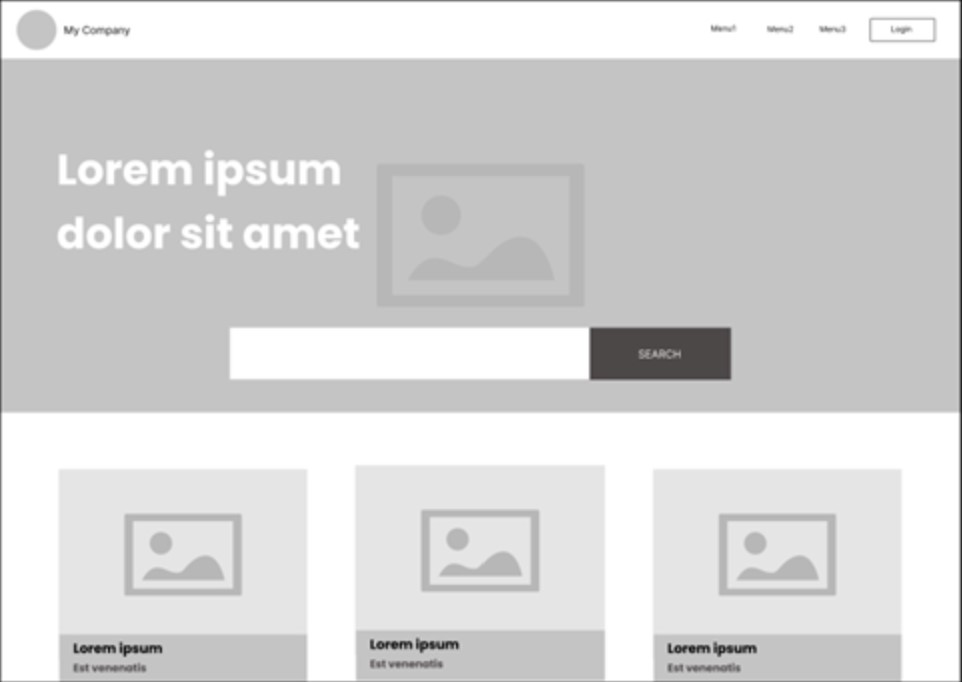
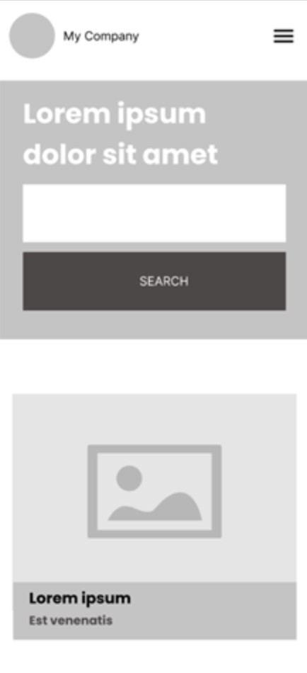

# The Kimura Dojo

<!-- PROJECT LOGO -->
<br />
<div align="center">
  <a href="https://github.com/othneildrew/Best-README-Template">
    
  </a>
  </div>

<!--  -->

## A simple listing website home page

---

### **Overview**

- Implement the wire frame of a listing website home page. The digital team would like to prototype a solution that resembles the wire frame below:



- Built with front-end framework of own choice, along with images and colour palette.

- Search functionality not needed

- Responsiveness using wire frame below as a guide is optional:



---

### **About my project**

I have created a website under the company name of **_The Kimura Dojo_**. Incorporating both my name and love for anime & martial arts. The Kimura Dojo is martial arts school, specializing in kendo, judo and jujitsu. Users to the website can search for former apprentices that trained at the dojo.

### **Purpose**

The purpose of this project was to implement SASS styling for the first time. Prior to this I had only used CSS while using the React js framework.

### **Built with:**

- [React.js](https://img.shields.io/badge/React-20232A?style=for-the-badge&logo-react&logoColor=61DAFB "Reactjs")
- [React-url](https://reactjs.org/ "Reacturl")
- [Sass-lang.com](https://img.shields.io/badge/Sass-20232A?style=for-the-badge&logo-sass&logoColor=CF649A "Sasslangcom")
- [Sass-url](https://sass-lang.com/ "Sassurl")

---

### **Getting started:**

### _Prerequisites -_

#### _The software needed to install -_

- React

  ```sh
  npx create-react-app .
  ```

- React Router Dom

  ```sh
  - npm install react-router-dom
  ```

- React Icons

  ```sh
  - npm install react-icons --save
  ```

- Sass

  ```sh
  - npm install -g sass
  ```

---

### Installation

1. Clone the repo

   ```sh
   git clone https://github.com/HMoana/M0.git
   ```

2. Install NPM packages

   ```sh
   npm install
   ```

---

### **Features:**

- Functional search bar
- Responsive page
- Hamburger Menu
- Modal login (extra function)

---

### **Future improvements:**

- Functional search bar needs better responsiveness, particularly the close icon
- Hamburger Menu needs improved responsiveness, so aside nav menu extends across entire screen (mobile device screens)
- Modal login needs responsiveness
- Login and Subscription can be improved to incorporate better validation methods and messages
- Improve BEM naming conventions for class names and SCSS nesting

---

### **Contact:**

Heni Kimura - henace86@gmail.com

### **Project Link:**

[Github repository](https://github.com/HMoana/M0.git "Github repository")

### **License:**

Distributed under the MIT License. See LICENSE.txt for more information.

### **Acknowledgments**

- Feedback from UX Designer Aneesha Baidwan
- Logo template [Canva](https://www.canva.com/templates/ "Canva")
- [Sass](https://sass-lang.com/ "Sass")
- [React Icons](https://react-icons.github.io/react-icons/ "React Icons")
- Code Focus SCSS Beginner Project [YouTube](https://youtu.be/IWJB76KU1jc "YouTube")
- PedroTech React and Sass Tutorial [YouTube](https://youtu.be/kpcjSaRngg8 "YouTube")
- Code Commerce Custom React js Modal [YouTube](https://youtu.be/D5oswSO9y-k "YouTube")
